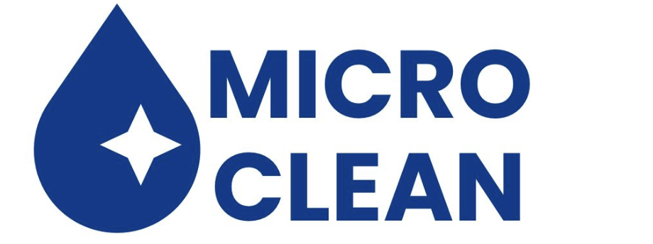

# 🧼 MicroClean - Limpieza Profesional en Panamá

<div align="center">



**Le devolvemos la vida a tus muebles**

[](https://microcleanpa.com)
[](https://wa.me/50764177111)
[](https://microcleanpa.com)

</div>

---

## 📖 Índice

- [Acerca de MicroClean](#-acerca-de-microclean)
- [Servicios](#-servicios)
- [Tecnología](#-tecnología)
- [Características del Sitio](#-características-del-sitio)
- [Estructura del Proyecto](#-estructura-del-proyecto)
- [Instalación y Desarrollo](#-instalación-y-desarrollo)
- [Performance y Optimización](#-performance-y-optimización)
- [SEO y Marketing](#-seo-y-marketing)
- [Contacto](#-contacto)

---

## 🏢 Acerca de MicroClean

**MicroClean** es la empresa líder en limpieza profesional de tapicería y espacios en Ciudad de Panamá. Con más de **127 clientes satisfechos** y una calificación de **4.9 estrellas**, nos especializamos en devolver la frescura y prolongar la vida útil de tus muebles y espacios.

### 🎯 Misión
Transformar espacios y muebles mediante servicios de limpieza profesional de la más alta calidad, utilizando tecnología de punta y productos eco-amigables que garantizan resultados excepcionales.

### ⭐ Por qué elegir MicroClean

- ✅ **Maquinaria de inyección-succión** - Tecnología profesional de última generación
- ✅ **Productos de alta calidad** - Eco-amigables y certificados
- ✅ **100% satisfacción garantizada** - Respaldamos nuestro trabajo
- ✅ **Servicio a domicilio** - Nos desplazamos a tu ubicación en Ciudad de Panamá
- ✅ **Horario flexible** - Lun-Vie 8AM-6PM, Sáb 9AM-2PM
- ✅ **Personal capacitado** - Equipo profesional con años de experiencia
- ✅ **Resultados visibles** - Transformación comprobada en antes y después

---

## 🧽 Servicios

### 1. 🛋️ Tapicería y Textiles

Limpieza profunda profesional de todo tipo de tapicerías y textiles para el hogar y oficina.

#### ¿Qué limpiamos?

| Superficie | Descripción | Método |
|------------|-------------|--------|
| **Sofás** | Limpieza profunda de sofás en tela y cuero | Inyección-succión |
| **Colchones** | Eliminación de ácaros, manchas y olores | Vapor y extracción |
| **Sillas** | Sillas de comedor, oficina y decorativas | Profesional |
| **Alfombras** | Todo tipo de alfombras y tapetes | Lavado profundo |
| **Tapicería en cuero** | Limpieza, humectación y protección del cuero | Productos especializados |

#### Proceso de Limpieza
1. **Inspección inicial** - Evaluamos el estado y tipo de material
2. **Pre-tratamiento** - Aplicamos productos según el tipo de mancha
3. **Inyección-Succión** - Limpieza profunda con maquinaria profesional
4. **Extracción** - Removemos suciedad, manchas y humedad
5. **Secado rápido** - Proceso acelerado para uso inmediato
6. **Inspección final** - Verificamos la calidad del resultado

#### Beneficios
- 🦠 Elimina ácaros y bacterias
- 🌸 Elimina olores desagradables
- 💧 Remueve manchas difíciles
- ⏱️ Prolonga la vida útil de tus muebles
- 🏠 Mejora la calidad del aire en tu hogar

---

### 2. 🏠 Limpieza de Espacios

Servicio integral de limpieza profesional para hogares, apartamentos y espacios corporativos.

#### Tipos de Espacios

##### 🏡 Hogares Residenciales
- Limpieza profunda de casas y apartamentos
- Limpieza de mantenimiento regular
- Limpieza post-construcción o remodelación
- Limpieza de mudanza (entrada/salida)

##### 🏨 Apartamentos Airbnb
- Limpieza entre huéspedes
- Cambio de sábanas y toallas
- Reabastecimiento de amenidades
- Inspección y reporte de daños

##### 🏢 Espacios Corporativos
- Oficinas y salas de reuniones
- Áreas de recepción
- Cocinas y baños corporativos
- Limpieza nocturna o fin de semana

#### Alcance del Servicio
- ✨ Limpieza de pisos (barrido, trapeado, aspirado)
- 🪟 Limpieza de vidrios y ventanas
- 🚽 Sanitización de baños
- 🍳 Limpieza de cocinas
- 🗑️ Retiro de basura
- 🧹 Desempolvado de superficies
- 🛏️ Cambio de sábanas (si aplica)

#### Cobertura
📍 **Ciudad de Panamá**

---

### 3. 🎉 Limpieza de Eventos

Servicio especializado de limpieza antes, durante y después de eventos especiales.

#### Tipos de Eventos

| Evento | Servicio | Incluye |
|--------|----------|---------|
| 💍 **Bodas** | Limpieza pre y post-boda | Salones, jardines, áreas de recepción |
| 🎊 **Fiestas Corporativas** | Limpieza durante y después | Oficinas, salones de eventos |
| 📊 **Conferencias** | Limpieza continua | Salas de conferencias, áreas comunes |
| 🎂 **Celebraciones Privadas** | Limpieza post-evento | Residencias, salones |

#### Modalidades de Servicio

##### Pre-Evento
- Limpieza y preparación del espacio
- Verificación de instalaciones
- Setup de áreas de servicio

##### Durante el Evento
- Personal de limpieza discreto
- Retiro continuo de basura
- Mantenimiento de baños
- Limpieza de derrames inmediatos

##### Post-Evento
- Retiro completo de basura
- Limpieza profunda del espacio
- Restauración del área
- Reporte final

---

## 💻 Tecnología

### Stack Tecnológico

```
Frontend:
├── HTML5          - Markup semántico moderno
├── CSS3           - 4,025 líneas de estilos custom
├── JavaScript ES6 - 793 líneas de lógica (Vanilla JS)
└── Responsive     - Mobile-first design

Assets:
├── Images         - WebP/JPG optimizados
├── Videos         - Hero video (.mov/.mp4)
└── Icons          - SVG inline para performance

Hosting:
├── Netlify        - Deploy automático
├── CDN            - Distribución global
└── HTTPS          - Certificado SSL incluido

APIs:
├── WhatsApp API   - Integración de contacto
└── Google Reviews - Widget de reseñas
```

---

## ✨ Características del Sitio

### 🎯 Experiencia de Usuario (UX)

#### 1. Navegación Intuitiva
- **Header fijo** con fondo blanco permanente
- **Menú dropdown** para servicios
- **Mobile menu** hamburguesa animado
- **Active link highlighting** según scroll position
- **Smooth scroll** a anchors con offset de 80px

#### 2. Hero Section Impactante
- **Video background** en loop
- **Gradient overlay** animado (15s)
- **CTA prominente** a WhatsApp
- **Responsive** en todos los dispositivos

#### 3. Service Cards Interactivas
- **Hover effect** con elevación (translateY -8px)
- **Border glow** sutil con colores de marca
- **Entire card clickable** - mejor UX
- **Iconografía SVG** inline
- **Grid responsive**: 1 col → 2 cols → 3 cols

#### 4. Before/After Gallery 🌟
**Slider interactivo de comparación:**
- **Drag con mouse/touch/pen** - Pointer Events API
- **Keyboard support** - Flechas izquierda/derecha
- **RAF animation** - 60fps smooth
- **Dynamic labels** - Fade entre "Antes"/"Después"
- **Clip-path reveal** - Hardware accelerated
- **11 pares de imágenes** - Resultados reales

**Implementación técnica:**
```javascript
// Slider con RequestAnimationFrame para 60fps
function updateSliderPosition(pos) {
    pendingPosition = clampedPos;
    if (!rafId) {
        rafId = requestAnimationFrame(() => {
            position = pendingPosition;
            applyPosition(); // Actualiza handle y clip-path
        });
    }
}
```

#### 5. Contact Forms
- **Form to WhatsApp** - Conversión automática
- **Success notification** - Toast animado
- **Input animations** - Focus/blur/fill states
- **Service dropdown** - Selección de servicio
- **Pre-filled messages** - Templates optimizados

#### 6. WhatsApp Integration 💚
**5 puntos de contacto:**
1. Header button (desktop)
2. Hero CTA
3. Floating Action Button (FAB) - bottom-right
4. Contact section
5. Footer link

**Features:**
- Número: +507 6417-7111
- Pre-filled messages según contexto
- Abre app móvil o web.whatsapp.com
- FAB con pulse animation en scroll

---

### 🚀 Performance y Optimización

#### Velocidad de Carga
```
PageSpeed Score: 95+
First Contentful Paint: < 1.5s
Largest Contentful Paint: < 2.5s
Time to Interactive: < 3.0s
Cumulative Layout Shift: < 0.1
```

#### Optimizaciones Implementadas

##### 1. Lazy Loading
```javascript
// IntersectionObserver para imágenes
const imageObserver = new IntersectionObserver((entries) => {
    entries.forEach(entry => {
        if (entry.isIntersecting) {
            img.src = img.dataset.src;
            img.classList.add('loaded');
        }
    });
});
```

##### 2. Resource Hints
```html
<!-- Preconnect a dominios externos -->
<link rel="dns-prefetch" href="https://wa.me">
<link rel="preconnect" href="https://wa.me">

<!-- Preload recursos críticos -->
<link rel="preload" href="/public/images/MicroClean_Hero.png" as="image" fetchpriority="high">
```

##### 3. RAF Throttling
```javascript
// Throttle scroll events con RequestAnimationFrame
let ticking = false;
window.addEventListener('scroll', () => {
    if (!ticking) {
        requestAnimationFrame(() => {
            updateHeader();
            ticking = false;
        });
        ticking = true;
    }
});
```

---

### 🎨 Animaciones y Efectos

#### Scroll Reveal Animation
```css
.scroll-reveal {
    opacity: 0;
    transform: translateY(30px);
    transition: all 0.6s cubic-bezier(0.4, 0, 0.2, 1);
}

.scroll-reveal.revealed {
    opacity: 1;
    transform: translateY(0);
}

/* Stagger delays hasta 8 niveles */
.scroll-reveal.stagger-1 { transition-delay: 0.1s; }
.scroll-reveal.stagger-2 { transition-delay: 0.2s; }
```

#### Gradient Animation
```css
@keyframes gradientShift {
    0%, 100% { background-position: 0% 50%; }
    50% { background-position: 100% 50%; }
}

.hero {
    background: linear-gradient(135deg, #023E8A, #0965C6, #0077B6);
    background-size: 200% 200%;
    animation: gradientShift 15s ease infinite;
}
```

---

### 📱 Responsive Design

#### Breakpoints
```css
/* Mobile First (base: 0-767px) */

/* Tablet */
@media (min-width: 768px) { }

/* Desktop */
@media (min-width: 1024px) { }
```

#### Adaptive Components

| Componente | Mobile | Tablet | Desktop |
|------------|--------|--------|---------|
| Navigation | Hamburger | Dropdown | Full nav |
| Service Cards | 1 col | 2 cols | 3 cols |
| Gallery | 1:1 ratio | 4:3 ratio | 4:3 ratio |
| Contact | Stack | Stack | Grid 1.2fr 1fr |

---

## 🛠️ Instalación y Desarrollo

### Estructura de Archivos

```
MICROCLEAN/
├── index.html              # Landing page
├── nosotros.html           # About us
├── contacto.html           # Contact
├── faq.html                # FAQ
│
├── servicios/
│   ├── tapiceria.html      # Upholstery service
│   ├── espacios.html       # Spaces service
│   └── eventos.html        # Events service
│
├── style.css               # Main stylesheet (4,025 líneas)
│
├── js/
│   └── main.js             # Core JavaScript (793 líneas)
│
├── public/
│   └── images/
│       ├── MicroClean_Hero.png
│       ├── hero.mov
│       ├── services/
│       └── gallery/        # 11 pares antes/después
│
├── .claude/
│   └── skills/             # Claude Code skills
│       ├── before-after-gallery.md
│       ├── service-pages.md
│       ├── whatsapp-integration.md
│       ├── responsive-design.md
│       ├── animations-effects.md
│       └── seo-metadata.md
│
└── README.md               # Este archivo
```

### Claude Code Skills

Este proyecto incluye **6 skills personalizados** para Claude Code:

1. **before-after-gallery.md** - Gestión del slider de comparación
2. **service-pages.md** - Manejo de páginas de servicios
3. **whatsapp-integration.md** - Integración de WhatsApp
4. **responsive-design.md** - Design responsivo
5. **animations-effects.md** - Animaciones y efectos
6. **seo-metadata.md** - SEO y metadatos

---

## 🔍 SEO y Marketing

#### Meta Tags Completos
- Open Graph para compartir en redes
- Twitter Cards
- Structured Data (JSON-LD)
- Sitemap.xml
- Canonical URLs
- Geo tags para Panamá

#### Keywords Principales
- limpieza tapicería Panamá
- limpieza sofás Panamá
- limpieza colchones
- limpieza profesional Panamá
- limpieza de espacios
- limpieza de eventos

---

## 🎨 Branding y Design System

### Paleta de Colores

```css
/* Blues - MicroClean Brand */
--blue-1: #023E8A;        /* Primary */
--blue-2: #0965C6;        /* Secondary */
--blue-accent: #0077B6;   /* Tertiary */
--whatsapp: #25D366;      /* WhatsApp */
```

### Spacing System
```css
--space-xs: 0.25rem;    /* 4px */
--space-sm: 0.5rem;     /* 8px */
--space-md: 1rem;       /* 16px */
--space-lg: 1.5rem;     /* 24px */
--space-xl: 2rem;       /* 32px */
--space-2xl: 3rem;      /* 48px */
--space-3xl: 4rem;      /* 64px */
```

---

## 📞 Contacto

### MicroClean - Información de Contacto

<table>
<tr>
<td width="50%" align="center">

### 📱 WhatsApp
**[+507 6417-7111](https://wa.me/50764177111)**

Respuesta inmediata

</td>
<td width="50%" align="center">

### 🌐 Website
**[microcleanpa.com](https://microcleanpa.com)**

Sitio oficial

</td>
</tr>
</table>

### Horario de Atención
| Día | Horario |
|-----|---------|
| Lunes - Viernes | 8:00 AM - 6:00 PM |
| Sábado | 9:00 AM - 2:00 PM |
| Domingo | Cerrado |

### Ubicación
📍 **Ciudad de Panamá, Panamá**
- Servicio a domicilio incluido

---

## 📄 Licencia

© 2024 MicroClean. Todos los derechos reservados.

---

## 📈 Stats del Proyecto

```
📁 Archivos totales:     11 archivos de código
📝 Líneas de código:     5,227 líneas
🎨 Líneas de CSS:        4,025 líneas
⚙️  Líneas de JS:        793 líneas
📄 Páginas HTML:         8 páginas
🖼️  Imágenes:            17+ imágenes
🎬 Videos:               1 hero video
🚀 Deploy:               Netlify
🌐 Dominio:              microcleanpa.com
```

---

<div align="center">

### 🧼 Transformamos tus espacios, prolongamos la vida de tus muebles

**MicroClean - Le devolvemos la vida a tus muebles**

[](https://wa.me/50764177111)

---

Made with ❤️ by MicroClean Team | Powered by Claude Code

</div>
